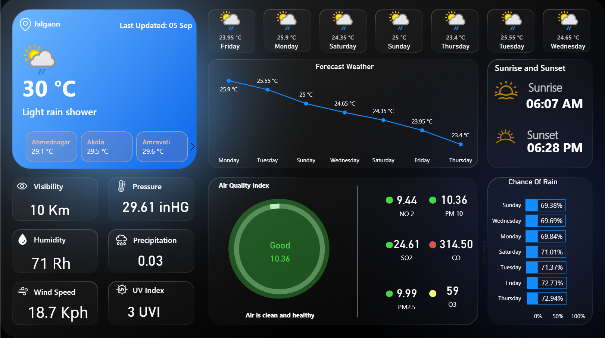

#  Realtime Weather Forecast Dashboard (Power BI)

##  Project Description
This project is a **Realtime Weather Forecast Dashboard** developed in Power BI, focused on visualizing weather conditions across **Maharashtra, India**.  
It integrates live data from a weather API using an API key via Power Query (M), delivering real-time insights for **current conditions**, **daily forecasts**, and **hourly forecasts**—all in a modern, themed layout.

---

##  Features
- **Current Weather**: Temperature, humidity, wind speed, pressure  
- **Air Quality Index (AQI)**: Clean / Moderate / Poor tier visualization  
- **Forecast Data**:
  - **Daily**: Next several days of projections  
  - **Hourly**: Intraday trends and shifts  
- **Enhancements**: Aesthetic theme, KPI visuals, region-specific focus (Maharashtra), and interactive filters  

---

##  Technology Stack
- **Power BI Desktop** – for dashboard and visual design  
- **Power Query (M)** – for API data retrieval and transformation  
- **Weather API** – for fetching live and forecast data  

---

##  Files Included
- `Weather_dashboard_maharasstra.pbix` – Power BI project file  
- `dashboard-preview.png` – Visual screenshot of the dashboard  
- `README.md` – (this document)

---

##  How It Works
1. **Fetches live weather data** via API (secured via parameterized key)  
2. Separately extracts **current**, **daily**, and **hourly** metrics  
3. Visualizes data using a clean, modern theme with interactive filters  

### How to Use:
- Download the `.pbix` file.  
- Open it in Power BI Desktop.  
- Insert your **Weather API key** under *Transform Data → Manage Parameters* or *Data Source Settings*.  
- Click **Refresh** for live data pull (Maharashtra).

---

##  Live Interactive Dashboard
[**View Live Dashboard on Power BI**](https://app.powerbi.com/view?r=eyJrIjoiMTdiYjhjMDgtMTZhYi00MDlhLWE0YWEtOWExMzY4MjAwYWE0IiwidCI6IjYzY2JlZWVlLTU5ZTktNDQ0Mi04Y2IzLThkMjM4MmRlM2FkNCJ9)

> *Note: This link is generated via Power BI’s “Publish to web” feature — it’s public and doesn’t require login. Be mindful of data privacy when using this method.* :contentReference[oaicite:2]{index=2}

---

##  Highlights
- Showcases **real-time weather analytics** in Power BI  
- Combines **current conditions**, **hourly breakdown**, and **daily forecasts** in one dashboard  
- Ideal as a **portfolio piece** for data analysts or BI developers  

---

##  Author & Contact
**Shubham Mali**  
Connect on LinkedIn: [linkedin.com/in/shubham-mali-498362352](https://www.linkedin.com/in/shubham-mali-498362352)

---

